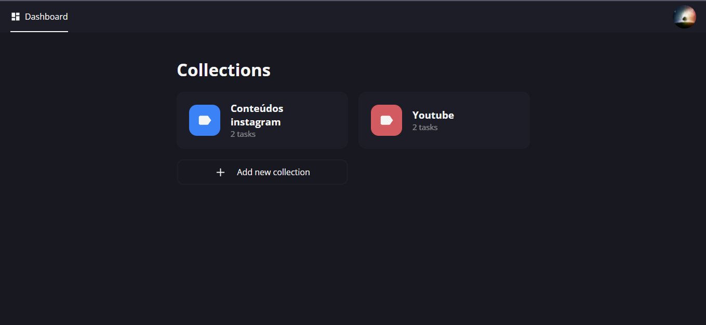

<h1 align="center">Tasks Collections</h1>

<p align="center">
  <a href="#dart-about">About</a> &#xa0; | &#xa0; 
  <a href="#sparkles-features">Features</a> &#xa0; | &#xa0;
  <a href="#rocket-technologies">Technologies</a> &#xa0; | &#xa0;
  <a href="#checkered_flag-starting">Starting</a> &#xa0; | &#xa0;
  <a href="#memo-license">License</a> &#xa0; | &#xa0;
  <a href="https://github.com/oleandrosiq" target="_blank">Author</a>
</p>

<br>

## 🎯 About ##

um sitema para Anotar suas tarefas em coleções.

<div align="center" id="top"> 
  
  

  &#xa0;
  <a href="https://youtube-collections.vercel.app/dashboard">Demo</a>
</div>

## ⭐ Features ##

✅ Feature Crud de collections;\
✅ Feature Crud de tasks;

## 🚀 Technologies ##

The following tools were used in this project:
- [React](https://pt-br.reactjs.org/)
- [TypeScript](https://www.typescriptlang.org/)

## ✅ Starting ##

```bash
# Clone this project
$ git clone https://github.com/oleandrosiq/youtube-collections
# Access
$ cd youtube-collections
# Install dependencies
$ yarn
# Run the project
$ yarn start
# The server will initialize in the <http://localhost:3000>
```


Made with 💖 by <a href="https://github.com/oleandrosiq" target="_blank">oleandrosiq</a>

&#xa0;

<a href="#top">Back to top</a>
